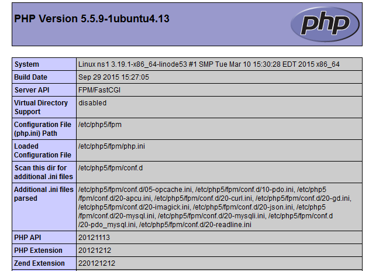

Introduction
===============

**LAMP** désigne un ensemble de 4 choses:

1. Linux
2. Un serveur web **Apache** 
3. My-sql
4. Le langage de programmation **php**

Ces 4 technologies forment une **pile** (stack en anglais) vous permettant l'hebergement de vos *sites* ou de vos *applications web dynamiques*.

Dans ce tuto, nous allons voir comment mettre en place ces 4 outils et installer PhpMyAdmin afin de gérer notre Base De Données grâce à une interface graphique.


Pré-Requis
==============

1. Des bases administratives sur Linux
2. Un minimum de logique


L'installation
===============

Etape 1: la mise à jour du système
---------------

Commençons par nous connecter à l'utilisateur "root" via la commande`su`
Afin d'être sur que tous les packages puissent être installés, il faut mettre à jour votre système via cette commande:
```sh
apt update && apt upgrade -y
```

Maintenant, nous sommes sur qu'aucun problème en rapport avec des packages ne surviendra !


Etape 2: créer un nouvel utilisateur avec les privilèges **sudo**
---------------

Pour des raisons pratiques mais également de sécurités, nous allons créer un nouvel utilisateur où nous gérerons et installerons notre serveur.
Pour créer l'utilisateur, il vous suffit de taper cette commande dans votre terminal:
```sh
adduser mynewuser
```
Ici, *mynewuser* sera notre nom d'utilisateur. Vous pouvez le remplacer par celui voulu.

Il vous sera demander plusieurs informations.
Certaines optionnelles tels que votre numéro de téléphone ou votre nom par exemple, d'autres seront obligatoires, votre mot de passe par exemple.

Une fois notre utilisateur crée, il nous faut le rajouter au groupe **sudo**.
Pour cela, tapez cette commande:
```sh
usermod -aG sudo mynewuser
```
*mynewuser* étant mon nom d'utilisateur, remplacez le par celui crée.

Enfin, connectons nous à ce compte grâce à cette commande:
```sh
su - mynewuser
```


Etape 3: installation du serveur web **Apache**
---------------

Maintenant que notre Linux est prêt, installons et configurons **Apache**

Nous allons installer la version 2. Pour ce faire, c'est très simple, il vous suffit de taper cette commande:
```sh
sudo apt install apache2 apache2-doc
```


Si tout s'est bien passé, vous avez maintenant accès à une la page web par défaut d'**Apache** à cette adresse: [localhost](http://127.0.0.1/) qui devrait ressembler à quelque chose dans ce genre


Pour vérifier l'état du service **Apache**:
```sh
sudo service apache2 status
```
Si la mention ***active (running)*** apparait, alors **Apache** est lancé.

Pour lancer **Apache**:
```sh
sudo service apache2 start
```

Pour stopper **Apache**:
```sh
sudo service apache2 stop
```

Pour relancer **Appache**:
```sh
sudo service apache2 restart
```


Etape 4: installation de PHP
---------------

Ici, nous utiliserons la version la plus récente de **php**, la version 5.
Pour l'installer, tapez cette commande:
```sh
sudo apt install php5-common libapache2-mod-php5 php5-cli
```

Pour vérifier notre installation, executez ces deux commandes:
```sh
cd /var/www/html
sudo nano info.php
```

L'éditeur **nano** vient de s'ouvrir dans votre terminal, recopiez les lignes ci dessous dans l'editeur:
```php
<?php
	phpinfo();
?>
```
Accédez ensuite au fichier via votre navigateur: [localhost/info.php](http://127.0.0.1/info.php)

Vous devriez voir une page listant toutes les spécifités de **php** ressemblant à ça


Une fois ce test fais, je vous recommande vivement de supprimer le fichier info.php que nous venons de créer, en effet, il n'est pas recommandé de donner publiquement des détails sur votre configuration.


Etape 5: installation de **MySQL**
---------------

Attaquon nous maintenant au système de base de données.

```sh
sudo apt install mysql-server
```
Cette commande vous servira à installer **MySQL**.

Par défaut, le mot de passe de **MySQL** est le même que celui de votre utilisateur système.
Pour sécuriser votre base de données, voici la commande à taper:
```sh
mysql_secure_installation
```

Entrez votre mot de passe "root", puis changez le mot de passe:
```sh
Change the root password? [Y/n] => y
New password:
```

Desactivez maintenant les connexions anonymes:
```sh
Remove anonymous users? [Y/n] => y
```

Desactivez la connexion "root" à distance:
```sh
Disallow root login remotely? [Y/n] => y
```

Maintenant, nous devons effacer la base de données de test par défaut:
```sh
Remove test database and access to it? [Y/n] => y
```

Chargeons ensuite les nouveaux paramètres:
```sh
Reload privilege tables now? [Y/n] => y
```

Voici la commande pour tester l'accès à votre base de données:
```sh
mysql -u root -p <password>
MariaDB [(none)]> show databases;
MariaDB [(none)]> exit
```

Etape 6: installation de PhpMyAdmin
---------------

La création de notre serveur LAMP est terminée, mais je vous conseil de suivre cette étape afin de gérer vos bases de données plus facilement. 
Bien entendu, c'est vous qui décidez ;).

Pour l'installer, tapez cette commande:
```sh
sudo apt install phpmyadmin
```

Cochez **apache2** puis faites entrée.
Acceptez l'aide à la configuration, puis rentrez le mot de passe que vous voulez.

Afin d'accéder à l'interface **PhpMyAdmin**, editez le fichier de configuration **apache** via cette commande:
```sh
sudo nano /etc/apache2/apache2.conf
```

A la fin du fichier, ajoutez ceci:
```conf
# Include phpMyAdmin
Include /etc/phpmyadmin/apache.conf
```

Relancez ensuite le serveur **Apache** grâce à cette commande:
```sh
sudo service apache2 restart
```

Pour vous connectez, vous devez créer un utilisateur possédant les droits administrateurs comme suit:
```sh
mysql -u root -p <password>
MariaDB [(none)]> CREATE USER 'my_user'@'localhost' IDENTIFIED BY 'my_password';
MariaDB [(none)]> GRANT ALL PRIVILEGES ON * . * TO 'my_user'@'localhost';
MariaDB [(none)]> FLUSH PRIVILEGES;
```

Accédez ensuite à votre interface: [localhost/phpmyadmin](http://127.0.0.1/phpmyadmin/)


Et voila ! Le tuto est fini.
Si vous avez des question ou si vous voulez me donner votre avis ainsi que des idées de tuto ou d'améliorations, contactez moi sur discord: *Yukio#6174*
***
